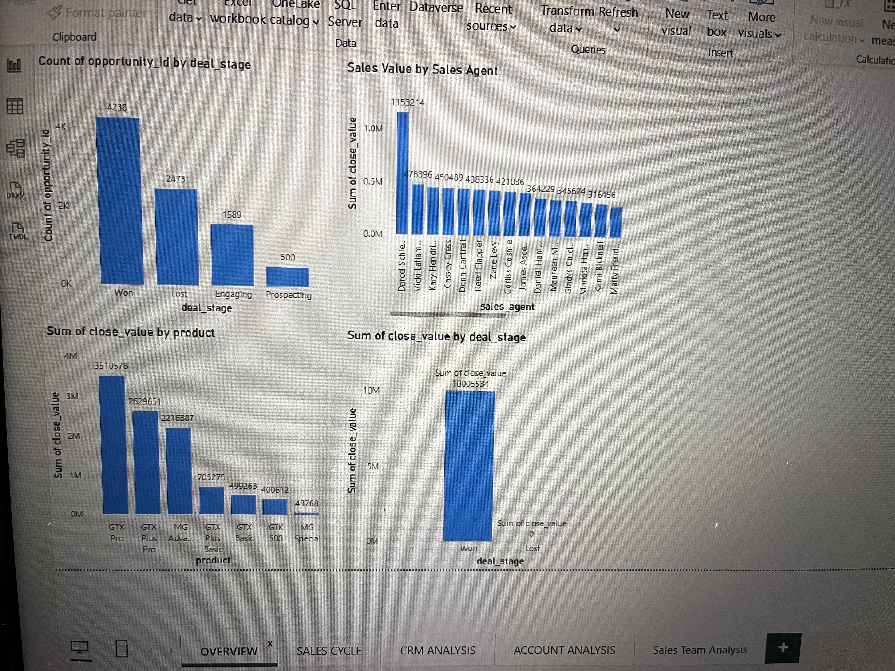
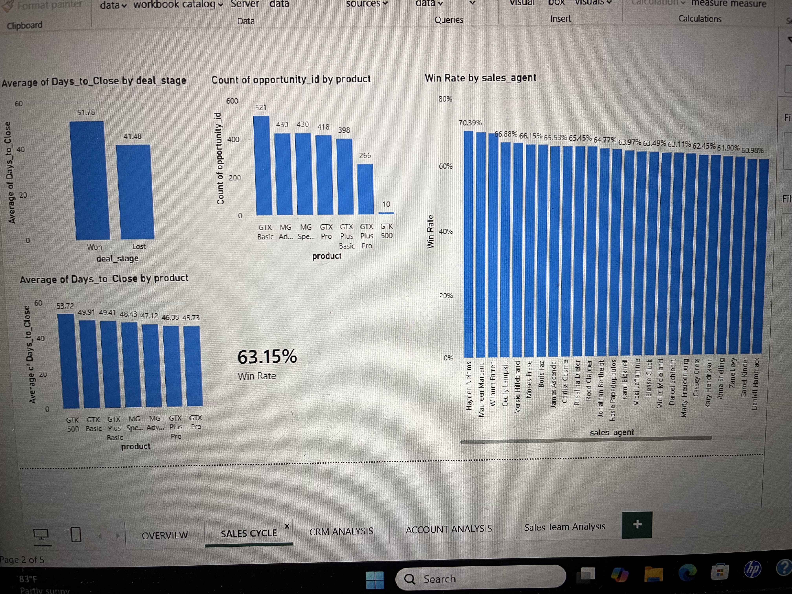
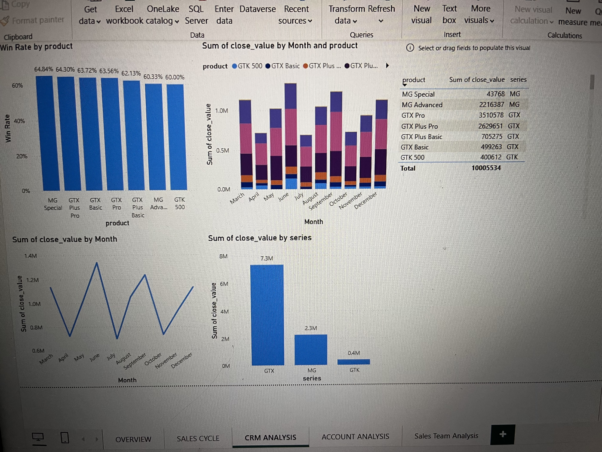
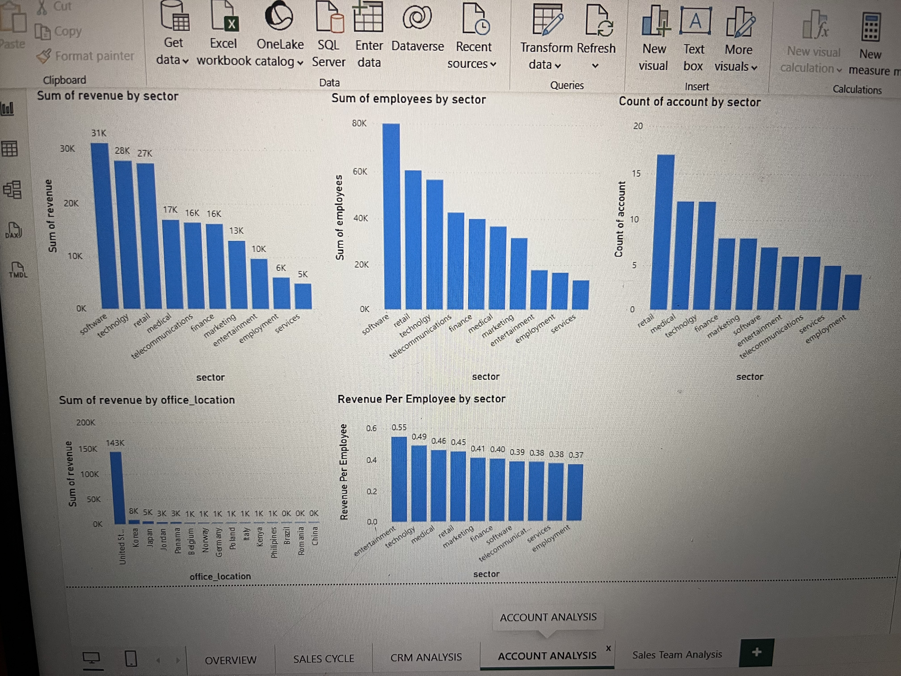
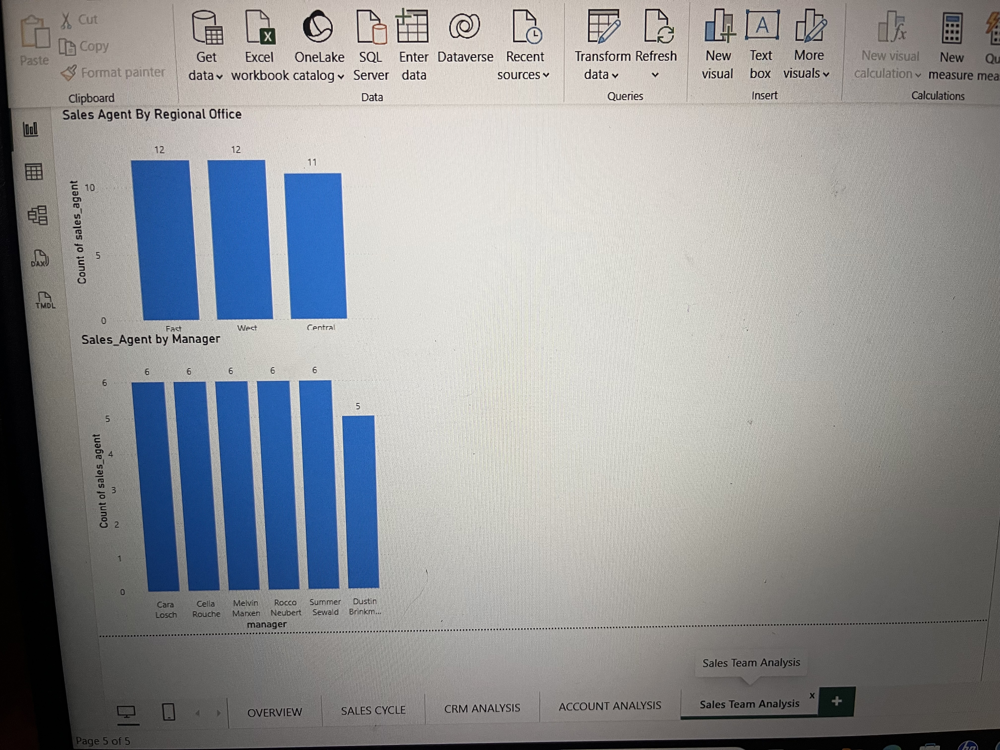

# Data Analytics Portfolio

Welcome to my data analytics portfolio.

I am an aspiring Data Analyst with practical experience in data cleaning, exploratory analysis, visualization, business analysis, and dashboard development.

## Skills

- Power BI
- Python
- Pandas
- Matplotlib
- SQL
- Data Cleaning
- Data Visualization
- Business Analysis
- Data Modeling
- DAX

## Featured Projects

### 1. CRM Sales Pipeline & Account Analysis
**Tools:** Power BI, Power Query, DAX

An interactive business intelligence project analyzing sales opportunities, accounts, products, sales teams, deal stages, and sales performance.

**Key areas analyzed:**
- Sales pipeline performance
- Win rate
- Revenue by account and sector
- Sales agents and managers
- Sales team distribution
- Revenue per employee
- Account and product performance

**Business focus:** Identifying sales trends, performance gaps, and opportunities for improving sales effectiveness.

---

### 2. Retail Sales & Profitability Analysis
**Tools:** Python, Pandas, Matplotlib

A practical data analysis project focused on cleaning, exploring, analyzing, and visualizing retail sales data.

**Key areas analyzed:**
- Sales performance
- Profitability
- Product categories
- Regional performance
- Customer and business trends

**Business focus:** Turning raw sales data into insights that support better business decisions.

---

### 3. SQL Business Analysis
**Tools:** SQL

A collection of practical SQL analyses demonstrating the ability to query, filter, aggregate, sort, and analyze business data.

**Skills demonstrated:**
- SELECT and filtering
- GROUP BY
- Aggregate functions
- ORDER BY
- Business-focused queries
- Data exploration

## Dashboard Visuals

### CRM Sales Overview

### Sales Cycle Analysis

### CRM Analysis

### Account Analysis

### Sales Team Analysis

## About Me

I enjoy using data to understand business performance, identify patterns, and communicate insights clearly.

I am currently seeking opportunities to contribute as a Junior Data Analyst or Data Analyst.

## Contact

Email: [oluchirose7@gmail.com]

LinkedIn: [Your LinkedIn profile]
